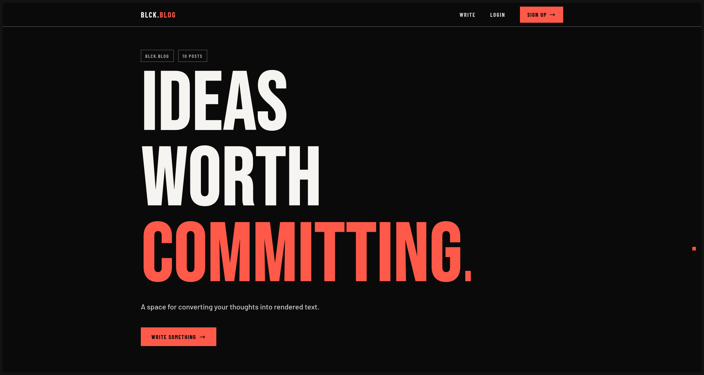
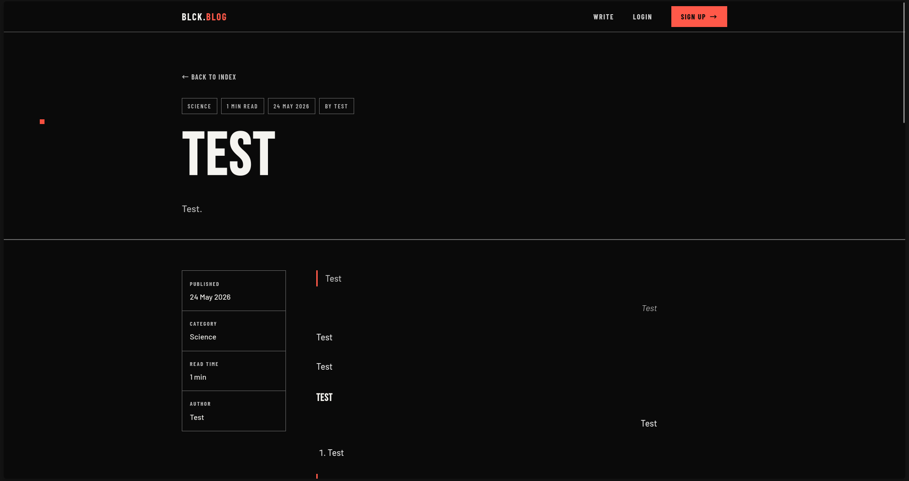

# BLCK.BLOG

> **Ideas Worth Committing.** — A dark-mode blog engine with Quill WYSIWYG editing, Supabase auth, and pixel-perfect typography.

---

## Features

- Rich-text editing (Quill) — bold, italic, headings, lists, blockquotes, alignment, links
- Sign-up / sign-in via Supabase Auth
- Category autocomplete — 28 curated categories
- Create, edit, delete posts with auto-generated excerpts and read-time estimates
- Pixel heart likes — 5×5 pixel-art toggle, real-time count
- Share — native `navigator.share()` with clipboard fallback
- Smart recommendations — suggests posts in categories you've liked
- Author profiles — `/profile/:id` with post grid; edit/delete for own posts
- Related posts — "Continue Reading" on each post
- Mobile responsive — hamburger nav, fluid layout

---

## Using the Blog

### Writing a Post

1. Click **Write** in the nav (or "Write Something" on the home page)
2. Enter a **title** and optional **category** (start typing to autocomplete from 28 curated categories)
3. Add an **excerpt** (or leave blank — one is auto-generated from the body)
4. Use the **Quill editor** to format your body text — toolbar has bold, italic, underline, strike, headings, ordered/bullet lists, alignment, blockquote, link, and clean button
5. Click **Publish Post**

### Editing & Deleting

- Visit your **profile page** (click your name in the nav) — every post you own has Edit and Delete buttons
- On a **post page**, if you're the author (or an admin), Edit and Delete appear in the sidebar

### Liking & Sharing

- Click the **pixel heart** (▦) below a post to like it — toggles red fill
- Click **Share** to use the system share sheet (copies URL to clipboard as fallback)

### Recommendations

- Once you've liked a few posts, the home page shows a **Recommended for You** section — posts in categories you've engaged with

### Profile & Logout

- Click your **name** in the nav to see all your posts
- **Logout** button is on your profile page

---

## Tech Stack

Node.js / Express 5 · EJS · Supabase (PostgreSQL + Auth) · Quill.js 1.3.7 · Vanilla CSS

---

## Quick Start

```bash
npm install
```

Copy `.env.example` to `.env` and add your Supabase credentials:

```env
SUPABASE_URL=https://your-project.supabase.co
SUPABASE_SECRET_KEY=sb_secret_your_service_role_key
SUPABASE_PUBLISHABLE_KEY=sb_publishable_your_anon_key
SESSION_SECRET=a-long-random-string
```

Run `backend/master.sql` in your Supabase SQL Editor to create the schema. Then:

```bash
node backend/seed.js   # optional: test user + 10 sample posts
npm start              # → http://localhost:3000
```

Deploy to Vercel by importing the repo and setting the same env vars.

---

## API Routes

| Method | Path | Auth | Description |
|---|---|---|---|
| GET/POST | `/auth/login` | — | Login |
| GET/POST | `/auth/signup` | — | Sign up |
| POST | `/auth/logout` | — | Logout |
| GET | `/` | — | Home |
| GET/POST | `/posts/new` | Required | Create post |
| GET/POST | `/posts/:id/edit` | Owner | Edit post |
| POST | `/posts/:id/delete` | Owner | Delete post |
| POST | `/posts/:id/like` | Required | Toggle like |
| GET | `/posts/:id` | — | View post |
| GET | `/profile/:id` | — | Author profile |

---

## Project Structure

```
backend/          auth.js, posts.js, likes.js, categories.js, master.sql, seed.js
public/           css/style.css, js/main.js, favicon.svg
views/            EJS templates (index, post, new, edit, profile, auth/*, partials/*)
server.js         Express app — routes, middleware, session
```

---

## Design

```
--red:   #ff5949    --black: #0a0a0a    --white: #f5f4f0
--grey:  #bcbcbc    --border:#666666    --card-bg: #111111
Fonts:   Bebas Neue (display) · Barlow Condensed (nav) · Barlow (body)
```

---

## Screenshots

<p align="center">
  
  <em>Home page — hero, post grid, recommendations.</em>
</p>

<p align="center">
  
  <em>Post view — sidebar, rich-text body, pixel heart, share.</em>
</p>

<p align="center">
  
  <em>New post — Quill editor, category autocomplete.</em>
</p>

<p align="center">
  
  <em>Profile — post grid, edit/delete, logout.</em>
</p>
